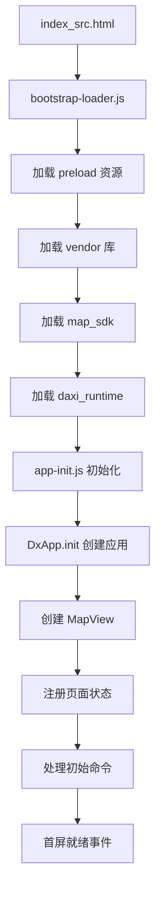

# 大希地图旧版业务逻辑分析报告

**项目位置**: `/home/ubuntu/.openclaw/workspace/code/daxi-aiguide-h5/app/navi_app/shouxihu/`  
**分析日期**: 2026-03-01  
**分析目标**: 为完全现代化重构提供业务逻辑参考

---

## 📋 一、项目结构概览

### 1.1 目录结构

```
shouxihu/
├── index_src.html              # 入口 HTML
├── js/                         # 核心 JavaScript 文件 (旧版)
│   ├── bootstrap-loader.js     # 资源加载器
│   ├── app-init.js             # 应用初始化
│   ├── daxiapp.api.js          # API 服务层
│   ├── dxapi.app.js            # 应用主入口
│   ├── daxiapp.mapView.js      # 地图视图核心 (52KB)
│   ├── daxiapp.page.command.js # 命令处理核心 (33KB)
│   ├── daxiapp.page.mapState*.js  # 各页面状态 (15+ 文件)
│   └── runtime-config.js       # 运行时配置
├── src/                        # 新版模块化代码 (ES Modules)
│   ├── main.js                 # 模块化入口
│   ├── application/            # 应用层 (usecases, commands, state)
│   ├── domain/                 # 领域模型 (poi, route, navigation)
│   ├── ui/                     # UI 层 (controllers)
│   ├── platform/               # 平台适配 (bridge, audio, location)
│   ├── core/                   # 核心服务 (config)
│   └── legacy/                 # 兼容层
├── css/                        # 样式文件
│   ├── main.css                # 主样式 (51KB)
│   ├── blue.css                # 蓝色主题 (68KB)
│   ├── base.css                # 基础样式 (27KB)
│   └── ...
├── images/                     # 图片资源 (22 个子目录)
├── assets/                     # 静态资源
├── audio/                      # 音频文件
├── fonts/                      # 字体文件
├── components/                 # 组件 (外部引用)
├── extend_guobo/               # 扩展模块
├── utils/                      # 工具函数
└── voucher/                    # 凭证相关
```

### 1.2 技术栈

| 类别 | 技术/库 | 说明 |
|------|---------|------|
| **核心框架** | 自研 DaxiApp/DxiMap | 基于 Zepto 的 MVC 架构 |
| **DOM 库** | Zepto 1.x | 轻量级 jQuery 替代 |
| **模板引擎** | Handlebars v3.0.3 | 模板渲染 |
| **UI 组件** | Swiper | 轮播/滑动组件 |
| **地图 SDK** | 自研 DaxiMap SDK | 室内/室外地图引擎 |
| **加密** | Crypto-JS, MD5 | 数据加密/签名 |
| **3D 引擎** | Three.js | 3D 渲染 |
| **通信** | WebSocket, JSBridge | 小程序/原生通信 |
| **构建** | 无 (直接加载) | 未使用打包工具 |

---

## 🏗️ 二、核心架构分析

### 2.1 应用启动流程



### 2.2 核心模块职责

| 模块 | 文件 | 职责 | 大小 | 复杂度 |
|------|------|------|------|--------|
| **地图视图** | `daxiapp.mapView.js` | 地图初始化、控件管理、图层管理 | 52KB | ⭐⭐⭐⭐⭐ |
| **命令处理** | `daxiapp.page.command.js` | 命令分发、状态跳转、业务逻辑 | 33KB | ⭐⭐⭐⭐⭐ |
| **API 服务** | `daxiapp.api.js` | HTTP 请求、签名、数据获取 | 8KB | ⭐⭐⭐ |
| **应用入口** | `dxapi.app.js` | 应用创建、命令总线、下载器工厂 | 20KB | ⭐⭐⭐⭐ |
| **路由规划** | `daxiapp.page.mapStateRoute_new.js` | 路线计算、策略选择 | 37KB | ⭐⭐⭐⭐ |
| **导航** | `daxiapp.page.mapStateNavi.js` | 实时导航、语音播报 | 24KB | ⭐⭐⭐⭐ |
| **POI 展示** | `daxiapp.page.mapStatePoi.js` | 兴趣点展示、标记管理 | 22KB | ⭐⭐⭐ |

---

## 🎯 三、关键功能点分析

### 3.1 地图初始化流程

**核心代码位置**: `daxiapp.mapView.js` + `app-init.js`

```javascript
// 1. bootstrap-loader.js 加载所有依赖
// 2. app-init.js 创建初始化器
const initializer = createLegacyAppInitializer();
initializer.start();

// 3. DxApp.init 创建应用实例
appApi.init({
  container: "app",
  pages: DEFAULT_PAGES.map(createPageState),
  onCreate: (api) => {
    api.processCommand(params);
  }
});

// 4. MapView 初始化地图 SDK
const mapSDK = new daximap.Map("Container1", {
  token: params.token,
  appName: "daxiapp",
  baseMapPath: window.mapSDKPath + "map/",
  dataPath: params.dataRootPath,
  buildingId: params.buildingId,
  // ...
});

// 5. 创建位置管理器
const locationManager = new daximap.LocationManager(locOptions);

// 6. 添加地图控件
- FloorControl (楼层选择)
- CompassControl (指北针)
- IconButtonControl (爆炸图按钮)
- ComponentsWrapper (组件容器)
```

**关键配置**:
- Token: 开发者认证
- BuildingId: 建筑/景区 ID
- DataPath: 地图数据路径 (支持 CDN/本地)
- Platform: 平台类型 (android/ios/web)

### 3.2 POI 数据加载

**核心代码位置**: `daxiapp.page.command.js` + `daxiapp.api.js`

```javascript
// POI 数据获取方式
1. 从静态 JSON 加载
   - GET {staticUrl}/{token}/{bdid}/exhibit-all.json
   - GET {staticUrl}/{token}/{bdid}/explain-all.json

2. 从 API 服务加载
   - GET {apiUrl}/getPoiInfo?deptids=xxx&bdid=xxx
   - GET {apiUrl}/search?keyword=xxx&bdid=xxx

3. 从地图 SDK 加载
   - mapSDK.getPoiById(poiId)
   - mapSDK.searchPoi(keyword, options)
```

**数据结构**:
```javascript
{
  poiId: "P001",
  name: "景点名称",
  lon: 119.421747,
  lat: 32.405635,
  bdid: "B000A11DEA",
  floorId: "F1",
  address: "详细地址",
  type: "indoor/outdoor",
  // ...
}
```

### 3.3 路线规划逻辑

**核心代码位置**: `daxiapp.page.mapStateRoute_new.js`

```javascript
// 路线规划流程
1. 设置起点终点
   thisObject._startPoint = { lon, lat, bdid, floorId, name }
   thisObject._endPoint = { lon, lat, bdid, floorId, name }

2. 选择策略
   - indoor: 室内路线策略
   - outdoor: 室外路线策略 (步行/驾车/公交)

3. 调用路线规划 API
   mapSDK.calculateRoute({
     startPoint: start,
     endPoint: end,
     strategy: strategy,
     transittype: transittype
   })

4. 渲染路线结果
   - DXDriverRouteDetailView (驾车)
   - DXBusRouteDetailView (公交)
   - DXWalkRouteDetailView (步行)

5. 显示路线详情
   - 距离、时间、步骤
   - 地图高亮显示
```

**路线策略**:
```javascript
strategys: {
  indoor: [
    { strategy: "fastest", default: true },
    { strategy: "shortest" }
  ],
  outdoor: [
    { strategyCode: "walking", default: true },
    { strategyCode: "driving" },
    { strategyCode: "transit" }
  ]
}
```

### 3.4 导航功能

**核心代码位置**: `daxiapp.page.mapStateNavi.js` + `daximap.naviManager.js`

```javascript
// 导航管理
const naviManager = app._mapView._naviManager;

// 导航生命周期
naviManager.startNavi(route);    // 开始导航
naviManager.pauseNavi();         // 暂停导航
naviManager.resumeNavi();        // 恢复导航
naviManager.exitNavi();          // 退出导航

// 导航事件
naviManager.on("routeProgress", (data) => {
  // 更新导航状态
  // 语音播报
  // UI 更新
});

// AR 导航 (可选)
if (app._config.ARConfig) {
  thisObject.arNavigation = new daxiapp.ARNavigation(dom);
}
```

**导航 UI 组件**:
- `DXNaviEndInfoView` - 导航结束信息
- `DXNaviTipView` - 导航提示
- `DXNaviBottomView` - 底部控制栏
- `DXImageBtnComponent` - 楼层变化提示

### 3.5 用户交互

#### 点击事件处理

```javascript
// POI 点击
mapSDK.on("poiClick", (e) => {
  stateManager.pushState("MapStatePoiDetail", {
    poiId: e.poiId,
    bdid: e.bdid,
    floorId: e.floorId
  });
});

// 地图点击
mapSDK.on("mapClick", (e) => {
  // 显示坐标
  // 添加标记
});
```

#### 搜索功能

```javascript
// 搜索页面
MapStateSearchPage:
  - DXSearchComponent (搜索框)
  - DXHistoryListComponent (历史记录)
  - DXHotSearchComponent (热搜)
  - DXSelectPoiListComponent (搜索结果)

// 搜索流程
1. 用户输入关键词
2. 调用 searchPoi(keyword)
3. 显示搜索结果
4. 点击结果跳转详情
```

#### 语音交互

```javascript
// 语音监听
MapStateVoiceListenerPage:
  - 调用原生语音识别
  - 解析识别结果
  - 执行搜索或命令

// 语音播报
mapSDK.speak(text, options);
```

### 3.6 API 调用方式

**核心代码位置**: `daxiapp.api.js`

```javascript
// API 服务初始化
api.init(app);
// 设置:
// - appParams (token, bdid, userId...)
// - appConfig (scenic urls, userApi...)

// 请求方法
baseRequest({
  url,
  method: "GET/POST",
  params,
  data,
  headers,
  successFn,
  failedFn
});

// 签名机制
headers: {
  "X-Sign": signMd5Utils.getSign(url, data),
  "X-TIMESTAMP": signMd5Utils.getTimestamp(),
  "Content-Type": "application/json"
}
```

**主要 API 接口**:

| 接口 | 方法 | 用途 |
|------|------|------|
| `getScenicConfig` | GET | 获取景区配置 |
| `updateUserInfo` | POST | 更新用户信息 |
| `getExhibitAll` | GET | 获取景点列表 |
| `getExplainAll` | GET | 获取讲解列表 |
| `getSearchHotKey` | GET | 获取搜索热词 |
| `getProductList` | GET | 获取商品列表 |
| `createOrder` | POST | 创建订单 |

### 3.7 状态管理

**核心代码位置**: `daxiapp.page.command.js` + `daxiapp.stateMgr.js`

```javascript
// 状态管理器
const stateManager = api._stateManager;

// 状态注册
stateManager.registState(stateName, stateInstance);

// 状态跳转
stateManager.pushState("MapStatePoi", params);  // 压入新状态
stateManager.goBack();                          // 返回上一状态
stateManager.getCurrentState();                 // 获取当前状态
stateManager.getCurrentStateName();             // 获取当前状态名

// 状态生命周期
state.initialize(app, container);   // 初始化
state.show(params);                 // 显示
state.hide();                       // 隐藏
state.runCommand(command);          // 处理命令
state.dispose();                    // 销毁

// 事件机制
state._on("eventName", callback);   // 监听事件
state._emit("eventName", data);     // 触发事件
state._once("eventName", callback); // 一次性监听
```

**状态继承体系**:
```
MapStateClass (基类)
  ├── MapStateBrowse
  ├── MapStatePoi
  ├── MapStatePoiDetail
  ├── MapStateRoute
  ├── MapStateNavi
  ├── MapStateSearchPage
  ├── MapStateSimulateNavi
  ├── ...
  └── HomePage
      ├── ServicePage
      └── ProfilePage
```

---

## 📊 四、数据结构

### 4.1 核心数据模型

```javascript
// 应用参数
app._params = {
  token: "xxx",
  buildingId: "B000A11DEA",
  userId: "xxx",
  platform: "android_web",
  method: "initPage",
  // ...
};

// 应用配置
app._config = {
  scenic: {
    static_url: "https://cloud.daxicn.com/scenic",
    api_url: "https://cloud.daxicn.com/scenic"
  },
  route: {
    strategys: { indoor: [...], outdoor: [...] }
  },
  ARConfig: {...},
  terrainConfig: {...},
  // ...
};

// 命令对象
command = {
  method: "showPoi",
  poiId: "P001",
  bdid: "B000A11DEA",
  floorId: "F1",
  lon: 119.42,
  lat: 32.40,
  // ...
};
```

### 4.2 POI 数据结构

```javascript
{
  poiId: "P001",
  name: "景点名称",
  text: "显示名称",
  lon: 119.421747,
  lat: 32.405635,
  bdid: "B000A11DEA",
  floorId: "F1",
  floorName: "1F",
  address: "详细地址",
  type: "indoor",
  category: "exhibit",
  images: ["url1", "url2"],
  audio: "audio_url",
  video: "video_url",
  description: "描述",
  openTime: "开放时间",
  price: "价格",
  // ...
}
```

### 4.3 路线数据结构

```javascript
{
  routeId: "R001",
  distance: 1500,        // 米
  duration: 1200,        // 秒
  strategy: "fastest",
  transittype: "walking",
  startPoint: { lon, lat, bdid, floorId, name },
  endPoint: { lon, lat, bdid, floorId, name },
  steps: [
    {
      instruction: "向北走 100 米",
      distance: 100,
      duration: 60,
      lon: 119.42,
      lat: 32.40,
      action: "straight"
    },
    // ...
  ],
  path: [[lon, lat], ...]  // 坐标路径
}
```

---

## 🔌 五、API 接口清单

### 5.1 配置接口

| 接口 | 方法 | URL 模式 | 说明 |
|------|------|----------|------|
| 景区配置 | GET | `{staticUrl}/{token}/{bdid}/pages/config.json` | 获取景区完整配置 |
| 景点列表 | GET | `{staticUrl}/{token}/{bdid}/exhibit-all.json` | 获取所有景点 |
| 讲解列表 | GET | `{staticUrl}/{token}/{bdid}/explain-all.json` | 获取所有讲解 |
| 搜索热词 | GET | `{apiUrl}/getSearchHotKey` | 获取热门搜索词 |

### 5.2 用户接口

| 接口 | 方法 | URL | 说明 |
|------|------|-----|------|
| 更新用户信息 | POST | `https://map1a.daxicn.com/payApi/merchantApi/api/wxuser/add` | 保存用户信息 |
| 获取用户信息 | GET | `{apiUrl}/getUserInfo` | 获取用户详情 |

### 5.3 业务接口

| 接口 | 方法 | URL | 说明 |
|------|------|-----|------|
| 获取 POI 信息 | GET | `https://map1a.daxicn.com/wx3dmap/getPoiInfo` | 根据诊间 ID 获取 POI |
| 搜索 POI | GET | `{apiUrl}/search` | 搜索兴趣点 |
| 路线规划 | POST | `{apiUrl}/calculateRoute` | 计算路线 |
| 商品列表 | GET | `{apiUrl}/getProductList` | 获取商品列表 |
| 创建订单 | POST | `{apiUrl}/createOrder` | 创建支付订单 |
| 支付结果 | GET | `{apiUrl}/payResult` | 查询支付结果 |

### 5.4 WebSocket 接口

```javascript
// WebSocket 连接
wsBaseUrl: "wss://map.daxicn.com/ws/loc"

// 消息格式
{
  type: "postEventToMiniProgram",
  id: userId,
  methodToMiniProgram: "method=xxx&bdid=xxx&token=xxx",
  roleType: "receiver"
}

// 事件类型
- audioStatus: 音频状态
- paySuccessEvent: 支付成功
- showExhibit: 显示景点
- showAreaInTip: 进入区域提示
```

---

## 🗺️ 六、页面状态清单

### 6.1 核心页面状态

| 状态名 | 文件 | 功能 | 优先级 |
|--------|------|------|--------|
| `HomePage` | extend_guobo/js/daxiapp.page.home.js | 首页 | P0 |
| `ServicePage` | extend_guobo/js/daxiapp.page.service.js | 服务页 | P0 |
| `ProfilePage` | extend_guobo/js/daxiapp.page.profile.js | 个人中心 | P0 |
| `MapStateBrowse` | extend_guobo/js/daxiapp.page.mapStateBrowse.js | 浏览地图 | P0 |
| `MapStateMainPoiPage` | js/daxiapp.page.mapStateMainPoiPage.js | 主要 POI 页 | P0 |
| `MapStatePoi` | js/daxiapp.page.mapStatePoi.js | POI 列表 | P0 |
| `MapStatePoiDetail` | js/daxiapp.page.mapStatePoiDetail.js | POI 详情 | P0 |
| `MapStateRoute` | js/daxiapp.page.mapStateRoute_new.js | 路线规划 | P0 |
| `MapStateNavi` | js/daxiapp.page.mapStateNavi.js | 实时导航 | P0 |
| `MapStateSearchPage` | js/daxiapp.page.mapStateSearchPage.js | 搜索页 | P0 |

### 6.2 扩展页面状态

| 状态名 | 文件 | 功能 | 优先级 |
|--------|------|------|--------|
| `MapStateSimulateNavi` | js/daxiapp.page.mapStateSimulateNavi.js | 模拟导航 | P1 |
| `MapStateSelectPoint` | js/daxiapp.page.mapStateSelectPoint.js | 选择点位 | P1 |
| `MapStateChangeStartEndPoint` | js/daxiapp.page.mapStateChangeStartEndPoint.js | 修改起终点 | P1 |
| `MapStateSharePos` | js/daxiapp.page.mapStateSharePos.js | 分享位置 | P1 |
| `MapStateCreateGroup` | js/daxiapp.page.mapStateCreateShareGroup.js | 创建群组 | P2 |
| `MapStateShareGroup` | js/daxiapp.page.mapStateGroupShare.js | 分享群组 | P2 |
| `MapStateExhibitionRoute` | extend_guobo/js/daxiapp.page.exhibitionRoute.js | 展览路线 | P1 |
| `MapStateVisitNavi` | extend_guobo/js/daxiapp.page.visitNavi.js | 参观导航 | P1 |
| `VoiceListenerPage` | js/daxiapp.page.voiceListener.js | 语音监听 | P1 |
| `PoiDetailPage` | extend_guobo/js/daxiapp.page.poiDetail.js | POI 详情 (备用) | P2 |

### 6.3 其他页面状态

| 状态名 | 文件 | 功能 | 优先级 |
|--------|------|------|--------|
| `MapStateBuildingList` | js/daxiapp.page.mapStateBulldingList.js | 建筑列表 | P2 |
| `AboutPage` | extend_guobo/js/daxiapp.page.aboutPage.js | 关于页面 | P3 |
| `PayPage` | extend_guobo/js/daxiapp.page.payPage.js | 支付页 | P2 |
| `PayResultPage` | extend_guobo/js/daxiapp.page.payResultPage.js | 支付结果 | P2 |
| `IndexPage` | extend_guobo/js/daxiapp.page.index.js | 索引页 | P3 |
| `MapStateAutoPlayExhibit` | extend_guobo/js/daxiapp.page.mapStateAutoPlayExhibit.js | 自动播放 | P3 |
| `MapStateFavoritePage` | js/daxiapp.page.favorite.js | 收藏页 | P2 |

---

## 🔄 七、迁移优先级建议

### 7.1 迁移策略

**阶段一 (P0 - 核心功能)**: 必须先迁移的基础功能
**阶段二 (P1 - 重要功能)**: 常用功能，影响用户体验
**阶段三 (P2 - 扩展功能)**: 增值功能，可延后
**阶段四 (P3 - 边缘功能)**: 低频功能，可裁剪

### 7.2 详细迁移计划

#### 阶段一：核心基础 (预计 40% 工作量)

| 模块 | 优先级 | 说明 | 依赖 |
|------|--------|------|------|
| 1. 应用启动框架 | P0 | bootstrap + 初始化 + 命令总线 | 无 |
| 2. 地图视图核心 | P0 | MapView + 地图 SDK 集成 | 1 |
| 3. 状态管理器 | P0 | 状态机 + 事件系统 | 1 |
| 4. 配置服务 | P0 | 环境配置 + URL 管理 | 无 |
| 5. 桥接服务 | P0 | JSBridge + 平台适配 | 无 |
| 6. HomePage | P0 | 首页 UI + 导航 | 2,3 |
| 7. MapStateBrowse | P0 | 地图浏览 | 2,3 |
| 8. MapStatePoi | P0 | POI 展示 | 2,3,9 |
| 9. POI 数据服务 | P0 | POI 加载 + 缓存 | 4 |

#### 阶段二：关键功能 (预计 35% 工作量)

| 模块 | 优先级 | 说明 | 依赖 |
|------|--------|------|------|
| 10. MapStatePoiDetail | P1 | POI 详情页 | 9 |
| 11. MapStateSearchPage | P1 | 搜索功能 | 9 |
| 12. MapStateRoute | P1 | 路线规划 | 9,13 |
| 13. 路线服务 | P1 | 路线计算 + 策略 | 4 |
| 14. MapStateNavi | P1 | 实时导航 | 13,15 |
| 15. 导航服务 | P1 | 导航管理 + 语音 | 13 |
| 16. ServicePage | P1 | 服务页 | 3 |
| 17. ProfilePage | P1 | 个人中心 | 3 |

#### 阶段三：扩展功能 (预计 20% 工作量)

| 模块 | 优先级 | 说明 | 依赖 |
|------|--------|------|------|
| 18. MapStateSimulateNavi | P2 | 模拟导航 | 14,15 |
| 19. MapStateSelectPoint | P2 | 点位选择 | 9 |
| 20. MapStateChangeStartEndPoint | P2 | 修改起终点 | 12 |
| 21. MapStateSharePos | P2 | 位置分享 | 3 |
| 22. MapStateExhibitionRoute | P2 | 展览路线 | 9,13 |
| 23. MapStateVisitNavi | P2 | 参观导航 | 14,15 |
| 24. VoiceListenerPage | P2 | 语音输入 | 3 |
| 25. 支付功能 | P2 | 商品 + 订单 | 4 |

#### 阶段四：边缘功能 (预计 5% 工作量)

| 模块 | 优先级 | 说明 | 依赖 |
|------|--------|------|------|
| 26. MapStateCreateGroup | P3 | 创建群组 | 3 |
| 27. MapStateShareGroup | P3 | 群组分享 | 26 |
| 28. MapStateBuildingList | P3 | 建筑列表 | 9 |
| 29. AboutPage | P3 | 关于页面 | 3 |
| 30. 收藏功能 | P3 | 收藏夹 | 9 |
| 31. 自动播放 | P3 | 自动讲解 | 15 |

---

## 🎨 八、UI 组件清单

### 8.1 核心组件

| 组件名 | 用途 | 位置 |
|--------|------|------|
| `DXSearchComponent` | 搜索框 | components/ |
| `DXSearchViewComponent` | 搜索视图 | components/ |
| `DXPoiResultView` | POI 结果列表 | components/ |
| `DXPoiDetialView` | POI 详情视图 | components/ |
| `DXNaviBottomView` | 导航底部栏 | components/ |
| `DXNaviTipView` | 导航提示 | components/ |
| `DXNaviEndInfoView` | 导航结束信息 | components/ |
| `DXHistoryListComponent` | 历史记录 | components/ |
| `DXHotSearchComponent` | 热门搜索 | components/ |
| `DXSelectPoiListComponent` | POI 选择列表 | components/ |

### 8.2 路线组件

| 组件名 | 用途 | 位置 |
|--------|------|------|
| `DXDriverRouteDetailView` | 驾车路线详情 | components/ |
| `DXBusRouteDetailView` | 公交路线详情 | components/ |
| `DXWalkRouteDetailView` | 步行路线详情 | components/ |

### 8.3 基础组件

| 组件名 | 用途 | 位置 |
|--------|------|------|
| `DXBaseImageComponent` | 图片组件 | components/ |
| `DXBaseComponent` | 基础组件 | components/ |
| `DXImageBtnComponent` | 图片按钮 | components/ |
| `DXConfirmComponent` | 确认对话框 | components/ |

---

## 📦 九、依赖库清单

### 9.1 第三方库

| 库名 | 版本 | 用途 | 位置 |
|------|------|------|------|
| Zepto | 1.x | DOM 操作 | libs/zepto.min.js |
| Zepto.ext | - | Zepto 扩展 | libs/zepto.ext.js |
| Handlebars | v3.0.3 | 模板引擎 | libs/handlebars-v3.0.3.min.js |
| Swiper | - | 轮播组件 | libs/swiper/swiper-bundle.min.js |
| Three.js | - | 3D 渲染 | libs/three.min.js |
| Crypto-JS | - | 加密 | libs/crypto-js.js |
| MD5 | - | MD5 哈希 | libs/md5.js |
| QRCode | - | 二维码 | libs/qrcode.min.js |
| jweixin | 1.6 | 微信 SDK | libs/jweixin-1.6.js |
| voicePlugin | - | 语音插件 | libs/voicePlugin.js |
| uni.webview | 1.5.6 | UniApp WebView | libs/uni.webview.1.5.6.js |

### 9.2 自研库

| 库名 | 用途 | 位置 |
|------|------|------|
| DaxiMap SDK | 地图引擎 | map_sdk/map/ |
| DaxiApp JSBridge | 原生桥接 | jsbridge/daxiapp.jsbridge.js |
| DaxiApp Utils | 工具函数 | utils/daxiapp.utils.js |
| DaxiApp DOM | DOM 工具 | utils/daxiapp.dom.js |
| DaxiApp StateMgr | 状态管理 | utils/daxiapp.stateMgr.js |
| DaxiApp Component | 组件基类 | components/daxiapp.component.js |
| DaxiApp Cache | 缓存管理 | utils/daxiapp.cache.js |
| AR Navigation | AR 导航 | utils/ARNavigation.js |

---

## 🔧 十、技术债务与风险

### 10.1 主要技术债务

1. **无模块化**: 所有文件全局加载，依赖隐式
2. **全局变量污染**: `window.DaxiApp`, `window.DaxiMap`, `window.DxApp`
3. **代码重复**: `mapStateRoute.js` 和 `mapStateRoute_new.js` 并存
4. **样式耦合**: CSS 文件巨大 (main.css 51KB, blue.css 68KB)
5. **无类型安全**: 纯 JavaScript，无 TypeScript
6. **无构建流程**: 直接加载源文件，无打包优化
7. **回调地狱**: 大量嵌套回调，Promise 使用不一致
8. **硬编码**: URL、配置项硬编码在代码中

### 10.2 迁移风险

| 风险 | 影响 | 缓解措施 |
|------|------|----------|
| 功能遗漏 | 高 | 建立完整功能清单 + 自动化测试 |
| 性能下降 | 中 | 性能基准测试 + 渐进式迁移 |
| 兼容性问题 | 高 | 保留旧版入口 + 灰度发布 |
| 数据格式变化 | 中 | 保持 API 兼容 + 数据转换层 |
| 用户体验变化 | 中 | UI/UX 评审 + 用户测试 |

---

## ✅ 十一、迁移检查清单

### 11.1 功能完整性检查

- [ ] 地图加载与显示
- [ ] POI 搜索与展示
- [ ] 路线规划 (室内/室外)
- [ ] 实时导航
- [ ] 语音播报
- [ ] 用户定位
- [ ] 楼层切换
- [ ] 分享功能
- [ ] 支付流程
- [ ] 收藏功能

### 11.2 技术检查

- [ ] ES Modules 模块化
- [ ] TypeScript 类型定义
- [ ] 构建工具配置 (Vite/Webpack)
- [ ] 代码规范 (ESLint/Prettier)
- [ ] 单元测试 (Jest/Vitest)
- [ ] E2E 测试 (Playwright/Cypress)
- [ ] 性能优化 (代码分割/懒加载)
- [ ] 错误监控 (Sentry)
- [ ] 日志系统

### 11.3 兼容性检查

- [ ] Android WebView
- [ ] iOS WebView
- [ ] 微信小程序
- [ ] 现代浏览器
- [ ] 旧版浏览器 (如需支持)

---

## 📝 十二、总结与建议

### 12.1 架构评估

**优点**:
- ✅ 功能完整，覆盖导游场景全链路
- ✅ 模块化雏形 (src/目录的 ES Modules 重构)
- ✅ 命令总线模式，解耦状态与业务
- ✅ 跨平台支持 (Android/iOS/Web/小程序)

**缺点**:
- ❌ 技术栈老旧 (Zepto, Handlebars v3)
- ❌ 无构建工具，开发效率低
- ❌ 代码组织混乱，新旧代码并存
- ❌ 缺乏测试，重构风险高
- ❌ 性能优化不足，包体积大

### 12.2 重构建议

1. **保留核心，重写外围**
   - 保留 DaxiMap SDK (地图引擎)
   - 重写应用层 (UI + 状态管理 + 业务逻辑)

2. **渐进式迁移**
   - 先搭建新框架，逐步迁移功能
   - 保持旧版可用，灰度切换

3. **现代化技术栈**
   - Vue 3 / React (根据团队技术栈选择)
   - TypeScript (类型安全)
   - Vite (构建工具)
   - Pinia / Redux (状态管理)

4. **建立测试体系**
   - 单元测试覆盖核心逻辑
   - E2E 测试保证流程完整
   - 性能测试确保体验

5. **文档化**
   - API 文档
   - 组件文档
   - 部署文档

### 12.3 工作量估算

| 阶段 | 工作量 | 时间估算 (人天) |
|------|--------|-----------------|
| 阶段一 (P0) | 40% | 20-25 天 |
| 阶段二 (P1) | 35% | 15-20 天 |
| 阶段三 (P2) | 20% | 10-15 天 |
| 阶段四 (P3) | 5% | 3-5 天 |
| **总计** | **100%** | **48-65 天** |

---

**报告生成时间**: 2026-03-01  
**分析人**: AI Assistant  
**版本**: v1.0
