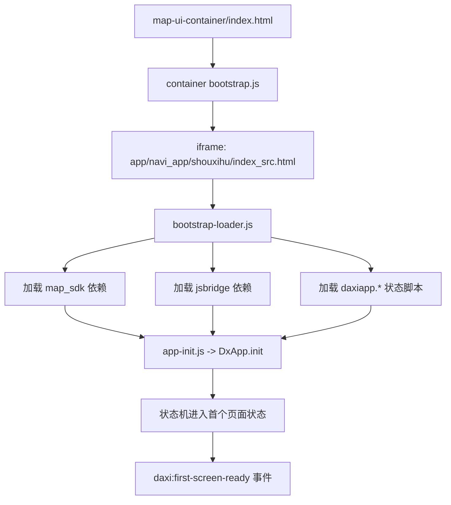

# 启动流程：容器 -> 地图页 -> SDK -> 状态机 -> 首屏完成

## 1. 总览

## 2. 关键阶段

1. **容器启动**
   - `map-ui-container/index.html` 只保留 iframe 和统一引导脚本入口。
   - `map-ui-container/assets/js/bootstrap.js` 负责容器脚本顺序加载、重试与超时兜底。
   - `map-ui-container/config/runtime-config.js` 在容器阶段注入环境矩阵与参数契约。

2. **地图页引导**
   - `app/navi_app/shouxihu/index_src.html` 通过 `bootstrap-loader.js` 统一管理所有脚本依赖。
   - `runtime-config.js` 在最前置阶段完成 token/buildingId 与 dataPath 注入。

3. **SDK / Bridge / 业务脚本加载**
   - `bootstrap-loader.js` 分组串行加载第三方、地图 SDK、桥接层与业务状态页。
   - 关键依赖 `map_sdk`、`jsbridge`、`daxiapp.*` 输出 `daxi:dependency-status` 埋点，记录 `loading/retry/loaded/failed` 及失败原因。

4. **状态机初始化**
   - `app-init.js` 负责首屏 loading 注入、`DxApp.init()` 以及入口命令分流。

5. **首屏完成事件**
   - `app-init.js` 在初始化完成后派发 `daxi:first-screen-ready`，用于外层容器或埋点系统监听首屏完成。

## 3. 失败兜底策略

- **单脚本加载失败**：最多重试 2 次，仍失败则上报原因并展示兜底页。
- **全局超时保护**：超过 bootstrap 超时时间直接展示兜底页，避免白屏长时间无反馈。
- **可观测性**：所有关键依赖状态挂载在 `window.__daxiBootstrapStatus`，并通过 `CustomEvent` 广播。

## 4. 参数契约

- 详见 `map-ui-container/docs/parameter-contract.md`。
- 父子 iframe 统一复用 runtime-config 提供的白名单参数读取，不再重复实现 `_getParam`。
